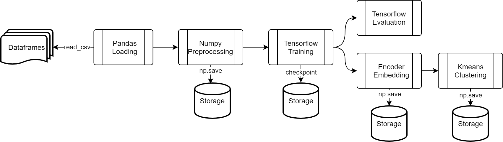

# ML Pipeline using a seq2seq model and openpflow data running on kubeflow


## Usage
To run the Process Pipeline, including all the steps needed to initialize and train the encoder and clustering models:
```bash
python3 process_pipeline.py
```
To run the Locus Pipeline to generate the .tar.gz that can be imported in Kubeflow Pipeline to create a run:
```bash
cd kubeflow_pipeline
python3 locus_pipeline.py
```